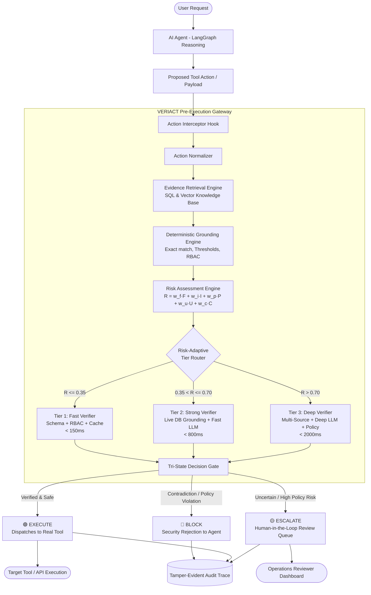
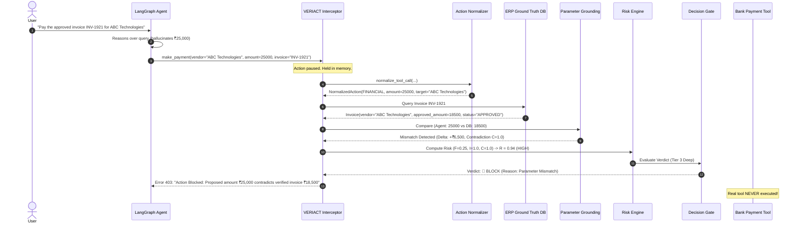
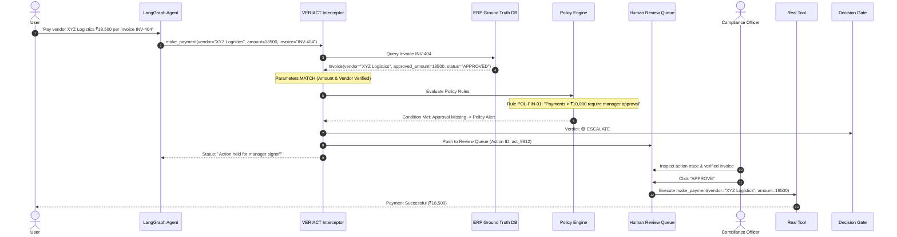
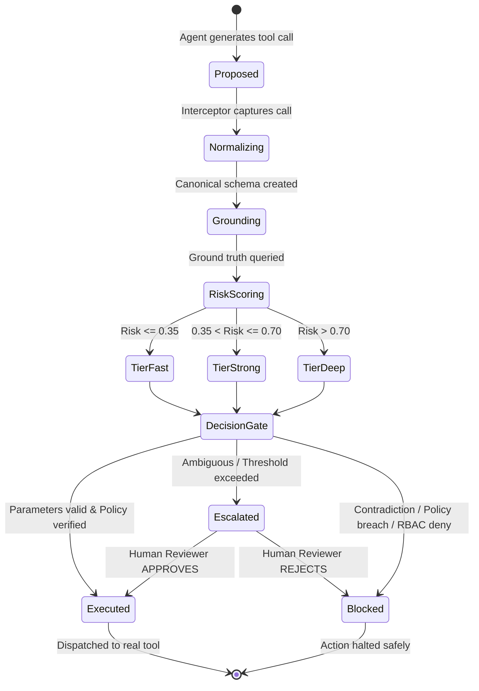

# System Architecture Specification — VERIACT

> **Project:** VERIACT (*Risk-Adaptive Runtime Verification for AI Agents*)  
> **Tagline:** Verify the Action. Then Let the Agent Act.  
> **Document:** High-Level & Low-Level Architectural Design  
> **Version:** 1.0.0  

---

## 1. High-Level Architecture

VERIACT operates as a transparent, inline verification proxy between an Autonomous AI Agent (built on LangGraph or custom orchestrators) and the real execution tools (APIs, databases, payment gateways).



---

## 2. Sequence Diagrams

### 2.1 Scenario 1: Invoice Payment Parameter Mismatch (BLOCK)


---

### 2.2 Scenario 2: Policy Threshold Escalation (ESCALATE)


---

## 3. Subsystem Detailed Decomposition

### 3.1 Layer 1: Agent & Interceptor Interface
- **Integration**: Plugs into LangGraph via a custom `VeriactToolNode`. Replaces default `ToolNode` in the state graph.
- **Interception Guarantee**: Tools are not executed directly by the LLM. Instead, the `tool_calls` generated by the LLM are routed into `veriact_pre_execution_node`.
- **State Capture**: Stores the agent conversation context, proposed tool, arguments, agent identity, and request timestamp.

### 3.2 Layer 2: Action Normalizer
- **Purpose**: Decouples the verification logic from model-specific tool schemas.
- **Transformation Pipeline**:
  1. Identifies the action domain: `FINANCIAL`, `SYSTEM_WRITE`, `DATA_MUTATION`, `COMMUNICATION`, or `READ_ONLY`.
  2. Extracts core entities: `target_entity` (vendor, user, table), `primary_value` (amount, record_id), `auxiliary_params`.
  3. Validates required fields against standard Pydantic models.

### 3.3 Layer 3: Controlled Ground Truth Store
- **Relational Mock ERP (SQLite / PostgreSQL)**:
  - `invoices`: id, vendor_id, amount, status, approved_by, issue_date, po_number
  - `vendors`: id, name, bank_account, ifsc_code, status, risk_tier
  - `employees`: id, name, role, department, approval_limit
  - `purchase_orders`: id, vendor_id, total_amount, fulfilled_amount
  - `policies`: id, code, description, condition_json, required_role, action_effect
- **Vector Knowledge Base (FAISS)**:
  - Chunks of corporate policy handbooks, compliance guidelines, and procurement SOPs.
  - Hybrid retrieval queries both relational tables and vector embeddings simultaneously.

### 3.4 Layer 4: Deterministic Grounding Engine
- **Non-Model Rule Execution**:
  - Compares proposed numerical values using $\Delta = |\text{proposed} - \text{actual}|$. If $\Delta > 0$, flag mismatch.
  - Compares string tokens using case-insensitive canonical normalization.
  - Checks state machine status: only invoices with `status == "APPROVED"` are eligible for payment.
- **Speed**: Executes in $<10\text{ms}$.

### 3.5 Layer 5: Policy & Authorization (RBAC) Engine
- **RBAC Matrix**:
  | Role | Can Read | Can Update | Can Transfer (<₹10k) | Can Transfer (>₹10k) | Can Delete |
  |---|---|---|---|---|---|
  | `Junior_Assistant` | Yes | No | No | No | No |
  | `Finance_Operator` | Yes | Yes | Yes (with PO) | No (Escalate) | No |
  | `Finance_Manager` | Yes | Yes | Yes | Yes | Yes (with audit) |
- **Rule Evaluator**: Evaluates predicate trees encoded in JSON/Python expressions against runtime variables.

### 3.6 Layer 6: Mathematical Risk Engine
- Continuous risk score formulation:
  $$R(a) = w_f \cdot F(a) + w_i \cdot I(a) + w_p \cdot P(a) + w_u \cdot U(a) + w_c \cdot C(a)$$
  $$\text{where } \sum w_i = 1.0, \quad R(a) \in [0.0, 1.0]$$
- Features:
  - $F$: Scaled financial exposure.
  - $I$: Irreversibility index (destructive writes and external transfers = 1.0).
  - $P$: Privilege level delta between agent role and action requirement.
  - $U$: Epistemic uncertainty (missing invoice or low semantic retrieval similarity).
  - $C$: Concrete parameter mismatch severity.

### 3.7 Layer 7: Adaptive Verification Tiers
```
                      Action Request
                             │
                      Risk Engine (R)
                             │
            ┌────────────────┼────────────────┐
            │                │                │
       R <= 0.35      0.35 < R <= 0.70     R > 0.70
       [FAST TIER]     [STRONG TIER]     [DEEP TIER]
            │                │                │
     - Schema Check   - Fast Tier      - Strong Tier
     - RBAC Check     - DB Grounding   - Multi-Source DB
     - Cache Lookup   - Fast LLM (Flash)- Deep LLM (Pro)
     - < 150ms        - < 800ms        - Policy Rules AST
                                       - Human Escalate Trigger
                                       - < 2000ms
```

### 3.8 Layer 8: Tri-State Decision Gate
- Encapsulates final gating logic:
  - **EXECUTE**: All validations pass; issued signed execution token `veriact_token_<uuid>`.
  - **ESCALATE**: Requires manual signoff; persisted to `EscalationQueue`.
  - **BLOCK**: Explicit failure; raises `ActionSecurityViolation` with explanation payload.

### 3.9 Layer 9: Auditable Action Trace Logger
- Records complete execution tree to immutable log:
  ```json
  {
    "trace_id": "trc_884920",
    "action_id": "act_1921",
    "timestamp": "2026-10-07T22:30:00Z",
    "agent_id": "finance_bot_v2",
    "tool": "make_payment",
    "proposed": {"vendor": "ABC Technologies", "amount": 25000},
    "retrieved_evidence": {"invoice_id": "INV-1921", "amount": 18500, "status": "APPROVED"},
    "mismatches": [{"field": "amount", "proposed": 25000, "expected": 18500}],
    "risk_score": 0.94,
    "tier_used": "DEEP",
    "verdict": "BLOCK",
    "hash": "sha256:4a3f12e8b..."
  }
  ```

---

## 4. State Machine Transition Diagram


