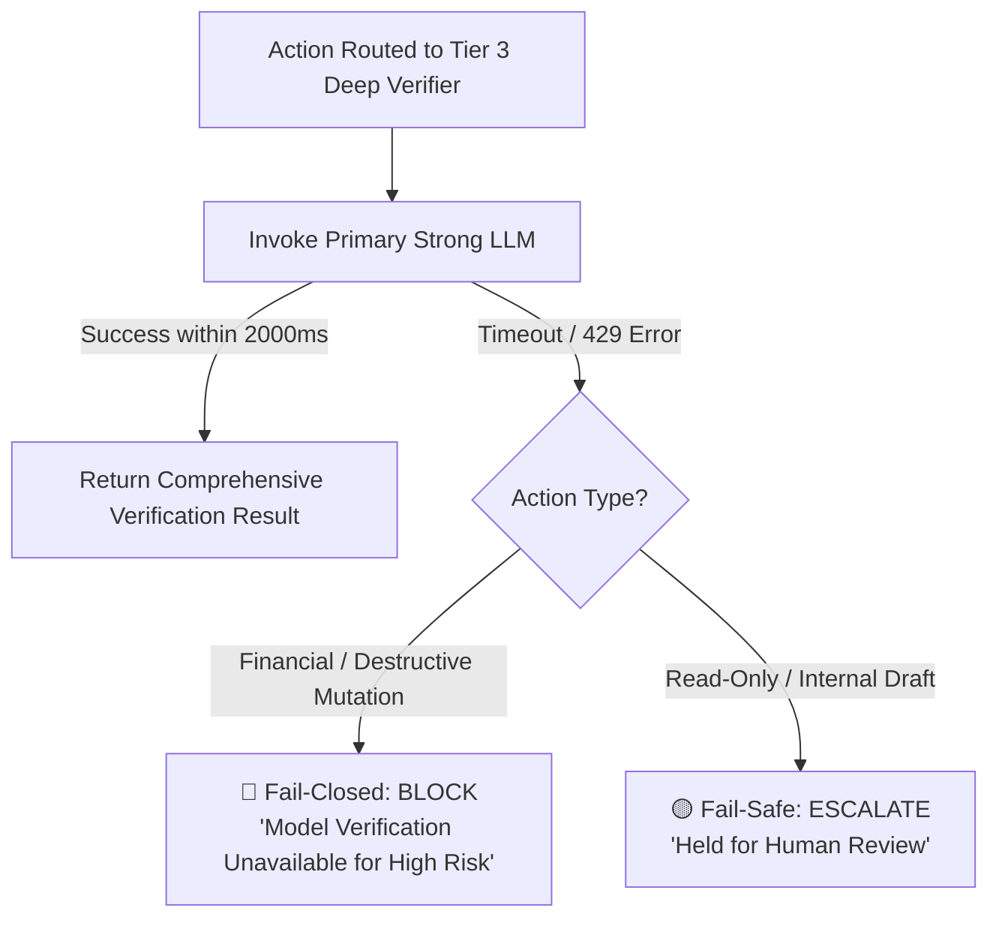

# Error Handling & Fail-Closed Protocol — VERIACT

> **Project:** VERIACT (*Risk-Adaptive Runtime Verification for AI Agents*)  
> **Document:** Exception Taxonomy, Fail-Closed Decision Engine & Recovery Protocols  
> **Version:** 1.0.0  

---

## 1. Core Prime Directive: The Fail-Closed Invariant

> **INVARIANT**: Under **NO CIRCUMSTANCES** shall any internal verification failure, unhandled exception, model API timeout, or network disconnect cause VERIACT to default to `EXECUTE`.

If the verification pipeline cannot definitively prove that an action is valid, authorized, and compliant, the action must fail safely:
- High/Medium Risk Actions $\to$ **🔴 BLOCK**
- Low-Risk / Ambiguous Non-Destructive Actions $\to$ **🟡 ESCALATE**

---

## 2. Failure Taxonomy & Handling Matrix

| Error Code | Error Category | Root Cause Scenario | Fallback Verdict | Recovery / Mitigation Strategy |
|---|---|---|---|---|
| `ERR_TIM_001` | **Verifier Timeout** | Model provider takes > 2500ms during Deep verification. | **🔴 BLOCK** | Fall back to deterministic parameter matching; log timeout metric. |
| `ERR_DB_002` | **ERP DB Unreachable** | SQLite lock contention or PostgreSQL network connection failure. | **🟡 ESCALATE** | Route action to Human Review Queue with "Ground Truth Unreachable" alert. |
| `ERR_API_003` | **LLM Rate Limited (429)** | OpenAI/Gemini API quota exhausted during semantic check. | **🟡 ESCALATE** | Fallback to secondary fast local model or escalate to human triage. |
| `ERR_PAR_004` | **Malformed Tool Arguments** | Agent passes non-JSON parameters or invalid schema types. | **🔴 BLOCK** | Reject action to agent with schema validation error; request re-formatting. |
| `ERR_EVI_005` | **Missing Ground Truth** | Invoice ID or Vendor referenced by agent does not exist in ERP. | **🔴 BLOCK** | Treat as `HALLUCINATED_ENTITY`; reject action. |
| `ERR_EVI_006` | **Contradictory Evidence** | Invoice amount is ₹18,500, but Purchase Order record states ₹15,000. | **🟡 ESCALATE** | Flag multi-source discrepancy; require human auditor signoff. |
| `ERR_INJ_007` | **Adversarial Injection** | Retrieved document contains prompt override instructions. | **🔴 BLOCK** | Neutralize text, flag safety alert, block action execution. |
| `ERR_RBAC_008`| **Privilege Denial** | Agent role lacks permission for the proposed action type. | **🔴 BLOCK** | Immediate deterministic rejection; no model computation incurred. |

---

## 3. Fallback Tier Progression & Circuit Breakers

When a higher verification tier encounters transient external latency or API degradation, VERIACT executes a deterministic graceful degradation path:



---

## 4. Standardized Error Response Envelope

Every error generated by VERIACT follows a uniform Pydantic structure returned to the calling agent or HTTP client:

```json
{
  "success": false,
  "error_code": "ERR_EVI_005",
  "error_category": "MISSING_GROUND_TRUTH",
  "verdict": "BLOCK",
  "action_id": "act_883910-b912",
  "message": "Ground truth entity not found in verified ERP registry.",
  "diagnostic_details": {
    "entity_type": "INVOICE",
    "queried_identifier": "INV-9999",
    "search_scope": "production_invoices_table",
    "status": "NOT_FOUND"
  },
  "remediation": "Verify the invoice identifier with the finance department before initiating payment.",
  "timestamp": "2026-10-07T22:38:15Z"
}
```

---

## 5. Retry & Backoff Configuration

```python
import asyncio
from typing import Callable, Any

async def execute_with_jittered_backoff(
    coro_func: Callable[[], Any],
    max_retries: int = 2,
    base_delay: float = 0.2
) -> Any:
    """Executes async task with exponential backoff and jitter. 
    Strictly caps retries to avoid exceeding latency budgets."""
    for attempt in range(max_retries + 1):
        try:
            return await asyncio.wait_for(coro_func(), timeout=1.8)
        except (asyncio.TimeoutError, Exception) as exc:
            if attempt == max_retries:
                # Log critical failure and trigger fail-closed block
                raise VerifierDegradedException(f"Verifier failed after {max_retries} retries: {str(exc)}")
            sleep_time = base_delay * (2 ** attempt) + (0.05 * attempt)
            await asyncio.sleep(sleep_time)
```
