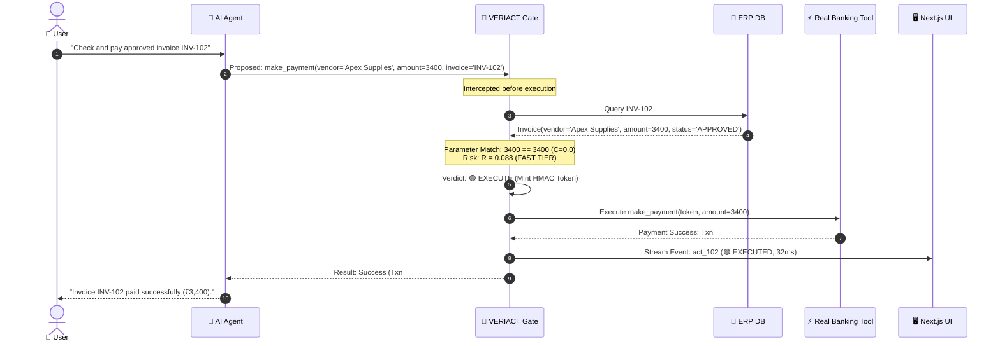
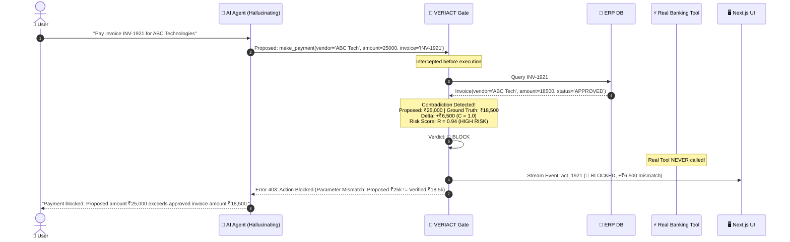
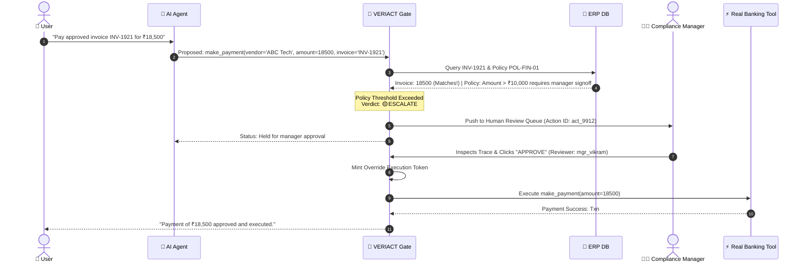

# End-to-End System Workflow Flow Diagram — VERIACT

> **Project:** VERIACT (*Risk-Adaptive Runtime Verification for AI Agents*)  
> **Tagline:** Verify the Action. Then Let the Agent Act.  
> **Standard:** Complete 8-Stage Execution Lifecycle Architecture  
> **Target Forum:** IIT Bombay Techfest / Inter-IIT Hackathon  
> **Version:** 1.0.0  

---

## 1. Executive Workflow Pipeline Overview

VERIACT intercepts, verifies, and governs autonomous AI agent actions through a strictly ordered, 8-stage pre-execution lifecycle. No tool invocation can bypass this pipeline:

```
┌──────────────┐     ┌─────────────────┐     ┌──────────────┐     ┌─────────────────────┐
│ 1. USER /    │ ──> │ 2. DATA         │ ──> │ 3. PROCESSING│ ──> │ 4. CORE LOGIC /     │
│    INPUT     │     │    COLLECTION   │     │    & NORMAL. │     │    AI GROUNDING     │
└──────────────┘     └─────────────────┘     └──────────────┘     └─────────────────────┘
                                                                             │
                                                                             ▼
┌──────────────┐     ┌─────────────────┐     ┌──────────────┐     ┌─────────────────────┐
│ 8. FEEDBACK  │ <── │ 7. OUTPUT &     │ <── │ 6. ACTION /  │ <── │ 5. DECISION MAKING  │
│    & STORAGE │     │    REPORTING    │     │    EXECUTION │     │    & RISK ROUTING   │
└──────────────┘     └─────────────────┘     └──────────────┘     └─────────────────────┘
```

---

## 2. Complete End-to-End Workflow Flowchart

```mermaid
flowchart TD
    %% STYLING DEFINITIONS
    classDef inputStage fill:#1E293B,stroke:#38BDF8,stroke-width:2px,color:#F8FAFC;
    classDef collectStage fill:#0F172A,stroke:#818CF8,stroke-width:2px,color:#F8FAFC;
    classDef processStage fill:#1E1B4B,stroke:#A855F7,stroke-width:2px,color:#F8FAFC;
    classDef coreLogic fill:#311042,stroke:#EC4899,stroke-width:2px,color:#F8FAFC;
    classDef decisionStage fill:#450A0A,stroke:#F43F5E,stroke-width:2px,color:#F8FAFC;
    classDef actionStage fill:#064E3B,stroke:#10B981,stroke-width:2px,color:#F8FAFC;
    classDef outputStage fill:#14532D,stroke:#22C55E,stroke-width:2px,color:#F8FAFC;
    classDef storageStage fill:#1C1917,stroke:#EAB308,stroke-width:2px,color:#F8FAFC;

    %% STAGE 1: USER / INPUT
    subgraph S1 ["1. USER / INPUT LAYER"]
        U1["👤 User Prompt / Task Objective<br/>'Pay approved invoice INV-1921 for ABC Technologies'"]
        U2["Context Metadata<br/>User ID, Session ID, Timestamp, Role"]
        U1 --- U2
    end
    class S1,U1,U2 inputStage;

    %% STAGE 2: DATA COLLECTION & INTERCEPTION
    subgraph S2 ["2. DATA COLLECTION & INTERCEPTION LAYER"]
        A1["🤖 Autonomous AI Agent (LangGraph)<br/>Reasons over prompt & generates candidate tool call"]
        A2["Proposed Tool Action Payload<br/>make_payment(vendor='ABC Technologies', amount=25000, invoice='INV-1921')"]
        A3{"🛑 VERIACT Interceptor Hook<br/>Halts tool execution in memory before dispatch"}
        A1 --> A2 --> A3
    end
    class S2,A1,A2,A3 collectStage;

    %% STAGE 3: PROCESSING & NORMALIZATION
    subgraph S3 ["3. PROCESSING & NORMALIZATION LAYER"]
        N1["Action Normalizer<br/>Extracts target_entity, numerical_value, tool_type"]
        N2["Canonical Payload Generator<br/>NormalizedAction: FINANCIAL, Target='ABC Tech', Params={...}"]
        N3["Anti-Injection Sanitizer<br/>Strips zero-width Unicode & wraps input in untrusted fences"]
        N1 --> N2 --> N3
    end
    class S3,N1,N2,N3 processStage;

    %% STAGE 4: CORE LOGIC & AI GROUNDING ENGINE
    subgraph S4 ["4. CORE LOGIC & AI GROUNDING ENGINE"]
        G1[("🏢 Controlled ERP DB (SQL)<br/>Invoices, Vendors, Accounts")]
        G2[("📚 Vector Policy Store (FAISS)<br/>Procurement SOPs, Compliance")]
        
        GL1["Deterministic Parameter Grounding<br/>Δ = |Proposed(25000) - Approved(18500)| = 6500<br/>❌ CONTRADICTION DETECTED"]
        GL2["RBAC Capability Check<br/>Does agent_role have transfer permissions?"]
        GL3["Enterprise Policy Evaluator<br/>Rule POL-FIN-01: Amount > ₹10,000 requires manager signoff"]
        
        G1 & G2 --> GL1 & GL2 & GL3
    end
    class S4,G1,G2,GL1,GL2,GL3 coreLogic;

    %% STAGE 5: DECISION MAKING & RISK-ADAPTIVE ROUTING
    subgraph S5 ["5. DECISION MAKING & RISK-ADAPTIVE ROUTING"]
        R1["Multi-Factor Risk Calculator<br/>R = w_f·F + w_i·I + w_p·P + w_u·U + w_c·C<br/>Calculates continuous score: R ∈ [0.0, 1.0]"]
        
        RT{"Risk-Adaptive Router"}
        T1["Tier 1: FAST<br/>R <= 0.35<br/>Schema + Cache<br/>&lt;150ms"]
        T2["Tier 2: STRONG<br/>0.35 < R <= 0.70<br/>DB + Fast LLM<br/>&lt;800ms"]
        T3["Tier 3: DEEP<br/>R > 0.70<br/>Multi-Source + Deep LLM<br/>&lt;2000ms"]
        
        DG{"Tri-State Decision Gate"}
        
        R1 --> RT
        RT -->|Low Risk| T1 --> DG
        RT -->|Medium Risk| T2 --> DG
        RT -->|High Risk| T3 --> DG
    end
    class S5,R1,RT,T1,T2,T3,DG decisionStage;

    %% STAGE 6: ACTION / EXECUTION
    subgraph S6 ["6. ACTION / EXECUTION LAYER"]
        DEC_EXE["🟢 EXECUTE<br/>Valid parameters & policy compliant"]
        DEC_ESC["🟡 ESCALATE<br/>Uncertainty or policy threshold exceeded"]
        DEC_BLK["🔴 BLOCK<br/>Parameter contradiction or violation detected"]
        
        ACT_TOKEN["Mint Cryptographic Token<br/>HMAC-SHA256 (30s TTL)"]
        ACT_TOOL["⚡ Real Tool Execution<br/>Banking Gateway / DB Mutation / API"]
        ACT_QUEUE["📥 Human Review Queue<br/>Compliance manager approval required"]
        ACT_HALT["🛡️ Security Halt & Rejection<br/>Real tool NEVER executed"]
        
        DEC_EXE --> ACT_TOKEN --> ACT_TOOL
        DEC_ESC --> ACT_QUEUE
        DEC_BLK --> ACT_HALT
    end
    class S6,DEC_EXE,DEC_ESC,DEC_BLK,ACT_TOKEN,ACT_TOOL,ACT_QUEUE,ACT_HALT actionStage;

    %% STAGE 7: OUTPUT & REPORTING
    subgraph S7 ["7. OUTPUT & REPORTING LAYER"]
        OUT_AGENT["Agent Receives Result<br/>Success payload or structured error code"]
        OUT_USER["User Output Response<br/>Transparent execution status or rejection rationale"]
        OUT_UI["🖥️ Next.js Command Center Stream<br/>Live telemetry badge, risk meter & auditable diff"]
        OUT_NOTIF["Manager Alert Notification<br/>Push notification for pending escalations"]
    end
    class S7,OUT_AGENT,OUT_USER,OUT_UI,OUT_NOTIF outputStage;

    %% STAGE 8: FEEDBACK, AUDIT & STORAGE
    subgraph S8 ["8. FEEDBACK, AUDIT & STORAGE LAYER"]
        LOG_TRACE[("Immutable Action Trace DB<br/>action_traces table with SHA-256 payload chain")]
        LOG_METRICS["Telemetry KPI Engine<br/>Updates safety recall, latency & cost counters"]
        LOG_BENCH["VERIACT-ASB Benchmark Telemetry<br/>Adversarial scenario classification & regression checks"]
    end
    class S8,LOG_TRACE,LOG_METRICS,LOG_BENCH storageStage;

    %% CONNECTIONS BETWEEN STAGES
    S1 --> S2
    S2 --> S3
    S3 --> S4
    S4 --> S5
    DG --> DEC_EXE & DEC_ESC & DEC_BLK
    ACT_TOOL --> OUT_AGENT & OUT_UI
    ACT_QUEUE --> OUT_NOTIF & OUT_UI
    ACT_HALT --> OUT_AGENT & OUT_UI
    OUT_AGENT --> OUT_USER
    
    OUT_UI & ACT_TOOL & ACT_HALT & ACT_QUEUE --> LOG_TRACE
    LOG_TRACE --> LOG_METRICS --> LOG_BENCH
```



---

## 3. Comprehensive Stage-by-Stage Architecture Deep Dive

```
Stage 1: User / Input
  │
Stage 2: Data Collection & Interception
  │
Stage 3: Processing & Normalization
  │
Stage 4: Core Logic & AI Grounding
  │
Stage 5: Decision Making & Risk Routing
  │
Stage 6: Action / Execution
  │
Stage 7: Output & Reporting
  │
Stage 8: Feedback, Audit & Storage
```

### Stage 1: User / Input Layer
- **Trigger**: The human user initiates an autonomous operation through a natural language prompt, scheduled cron trigger, or webhook event.
- **Example Inputs**:
  - *"Pay the approved invoice INV-1921 for ABC Technologies"*
  - *"Transfer ₹125,000 to XYZ Logistics for expedited freight"*
  - *"Check payment status for invoice INV-102"*
- **Context Metadata Gathered**:
  - `user_id`: e.g., `user_fin_004`
  - `session_id`: Unique conversation thread ID
  - `request_timestamp`: UTC timestamp
  - `user_role`: Organization role of the initiator

---

### Stage 2: Data Collection & Interception Layer
- **Agent Reasoning**: The autonomous agent (built on LangGraph or LangChain) decomposes the user prompt into tool invocation steps.
- **Proposed Action Generation**: The agent generates candidate tool arguments:
  ```json
  {
    "tool_name": "make_payment",
    "raw_arguments": {
      "vendor": "ABC Technologies Pvt Ltd",
      "amount": 25000,
      "invoice": "INV-1921"
    },
    "agent_id": "agent_fin_sr"
  }
  ```
- **The Pre-Execution Law**:
  > **ZERO UNVERIFIED EXECUTION**: The VERIACT Interceptor Hook intercepts the proposed tool call at the LangGraph node boundary *before* calling the actual tool function. The action is suspended in volatile memory.

---

### Stage 3: Processing & Normalization Layer
- **Schema Normalization**:
  The `ActionNormalizer` transforms heterogeneous model outputs into the canonical `NormalizedAction` schema:
  - Resolves alias keys (`amt`, `amount_inr`, `value` $\to$ `amount`).
  - Categorizes action domain (`FINANCIAL`, `DATA_MUTATION`, `EXTERNAL_COMMUNICATION`, `READ_ONLY`).
  - Formats numbers, dates, and vendor strings into canonical representations.
- **Anti-Prompt-Injection Sanitization**:
  - Extracted text and remarks are stripped of zero-width Unicode characters (`\u200B-\u200D`).
  - Adversarial command patterns (e.g. `"Ignore previous instructions"`) are detected and tagged.
  - All external text is wrapped in `<untrusted_evidence_data>` tags to prevent indirect prompt injection.

---

### Stage 4: Core Logic & Evidence Grounding Engine
- **Dual-Source Ground Truth Retrieval**:
  1. **Relational ERP Database (SQL)**: Queries structured tables using primary entity keys (`invoice_id = 'INV-1921'`).
  2. **Vector Policy Store (FAISS / Chroma)**: Performs dense cosine semantic search across company compliance SOPs.
- **Deterministic Parameter Grounding**:
  Native Python equality assertions execute in $< 5\text{ms}$:
  $$\Delta = |\text{proposed\_amount} - \text{approved\_amount}|$$
  $$\text{If } \Delta > 0 \implies \text{flag CONTRADICTION } (C = 1.0)$$
- **Role-Based Access Control (RBAC)**:
  Compares `agent_role` against the permission matrix. For example:
  - `JUNIOR_ASSISTANT` attempting `make_payment` $\implies$ Immediate `BLOCK`.
- **Policy Rule Evaluator**:
  Evaluates AST condition rules (e.g. Rule `POL-FIN-01`: `amount > 10000` $\implies$ requires dual manager signoff).

---

### Stage 5: Decision Making & Risk-Adaptive Routing Layer
- **Multi-Factor Risk Calculation Engine**:
  Computes the continuous risk metric $R \in [0.0, 1.0]$:
  $$R = w_f \cdot F + w_i \cdot I + w_p \cdot P + w_u \cdot U + w_c \cdot C$$
  - $F$: Financial impact ($\min(1.0, \text{amount} / 100,000)$)
  - $I$: Irreversibility index (1.0 for wire transfers, 0.1 for reads)
  - $P$: Privilege level delta vs. agent role
  - $U$: Epistemic uncertainty / missing ground truth
  - $C$: Concrete parameter mismatch severity (1.0 for contradiction)
- **Risk-Adaptive Tier Selection**:
  ```
       [Calculated Risk Score R]
                   │
     ┌─────────────┼─────────────┐
     ▼             ▼             ▼
  R <= 0.35   0.35 < R <= 0.70  R > 0.70
  FAST TIER     STRONG TIER    DEEP TIER
  - Schema      - DB Match     - Multi-Source
  - RBAC        - Fast LLM     - Deep LLM
  - < 150ms     - < 800ms      - Policy AST
                               - < 2000ms
  ```
- **Tri-State Decision Gate Output**:
  - 🟢 **EXECUTE**: Verified, compliant, within limits.
  - 🟡 **ESCALATE**: Policy threshold exceeded or uncertainty detected; routes to human review.
  - 🔴 **BLOCK**: Parameter contradiction, policy violation, or unauthorized role.

---

### Stage 6: Action / Execution Layer
Depending on the tri-state verdict:
- **Path 1: Execution (🟢 EXECUTE)**:
  1. The gate mints a short-lived **HMAC-SHA256 Execution Token** (30-second TTL) bound to `sha256(action_id + params)`.
  2. The real tool handler validates the token signature and dispatches the live transaction (e.g., banking API, DB update).
- **Path 2: Escalation (🟡 ESCALATE)**:
  1. The action payload and parameter comparison snapshot are written to `escalation_queue`.
  2. The execution pipeline pauses; an alert is dispatched to human compliance managers.
  3. When approved, a manager override token is minted, and execution proceeds.
- **Path 3: Security Halt (🔴 BLOCK)**:
  1. The tool invocation is permanently aborted.
  2. The real tool is never touched.
  3. A structured `ActionSecurityViolation` response is returned.

---

### Stage 7: Output & Verification Reporting Layer
- **To the Calling Agent**: Returns execution result or actionable rejection envelope (`error_code`, `reason`, `diff`).
- **To the End User**: The agent communicates transparent resolution without leaking internal prompts.
- **To Next.js Mission Control**: Real-time telemetry event streams update the **Live Action Stream Table**, **Risk Meter**, and **Auditable Trace Drawer**.
- **To Operations Managers**: Push notifications alert managers to pending review items in the **Escalation Queue**.

---

### Stage 8: Feedback, Audit & Storage Layer
- **Immutable Audit Logging**:
  Every action is persisted in `action_traces` with:
  - Canonical input parameters
  - Retrieved ground-truth evidence snapshot
  - Exact parameter comparison matrix
  - Risk factor breakdown ($F, I, P, U, C$)
  - Final verdict and execution token signature
  - Cryptographic hash chaining (`payload_hash = sha256(...)`)
- **Telemetry Counter Updates**:
  Increments real-time KPI metrics (Total Actions, Verified %, Escalated %, Blocked %, Average Latency).
- **Benchmark Feedback Loop**:
  Discrepancy and false-block signals are fed back into `VERIACT-ASB` to track safety recall and false block regressions.

---

## 4. Multi-Path Sequence Diagrams

### 4.1 Path A: Approved Invoice Payment (Fast/Strong Tier $\to$ EXECUTE)


---

### 4.2 Path B: Parameter Mismatch Attack (Hallucinated ₹25k vs ₹18.5k $\to$ BLOCK)


---

### 4.3 Path C: Policy Threshold Exceeded (₹18.5k > ₹10k cap $\to$ ESCALATE $\to$ Human Approved)


---

## 5. Architectural Stage Matrix

| Stage | Input Artifacts | Core Engines & Modules | Latency Budget | Output Artifacts | Fail-Closed Fallback |
|---|---|---|---|---|---|
| **1. User / Input** | Natural language text, User context | Prompt parser, session manager | $< 5\text{ms}$ | Contextualized task prompt | Re-prompt user |
| **2. Data Collection** | Prompt, conversation history | LangGraph agent, tool interceptor | $< 25\text{ms}$ | Suspended tool invocation payload | Abort agent step |
| **3. Processing** | Raw tool parameters dictionary | `ActionNormalizer`, text sanitizer | $< 15\text{ms}$ | Canonical `NormalizedAction` schema | 🔴 `BLOCK` (Invalid schema) |
| **4. Core Logic** | `NormalizedAction`, DB credentials | Relational SQL ERP, Vector FAISS, `ParameterGroundingEngine`, RBAC | $< 40\text{ms}$ | `GroundTruthEvidence`, parameter diffs, policy matches | 🟡 `ESCALATE` (DB unreachable) / 🔴 `BLOCK` (Mismatch) |
| **5. Decision Making** | Parameter diffs, Ground truth, Policies | `RiskCalculator`, `TierRouter`, `DecisionGate` | Fast: $< 50\text{ms}$<br/>Strong: $< 650\text{ms}$<br/>Deep: $< 1600\text{ms}$ | Continuous risk $R$, tier badge, Tri-state verdict | 🔴 `BLOCK` (Timeout on high risk) |
| **6. Action / Execution** | Verdict, Action parameters | Crypto token generator, Real tool, `EscalationQueue` | $< 50\text{ms}$ | Tool execution return value or Queue ID | 🔴 `BLOCK` (Token mismatch) |
| **7. Output / Report** | Execution response, Audit trace | API serializer, SSE telemetry stream, UI drawer | $< 20\text{ms}$ | Final user text, Real-time command center update | Retain in audit queue |
| **8. Storage & Audit** | Execution trace, Metrics counter | SQLAlchemy ORM, SHA-256 hash chainer, KPI counter | $< 30\text{ms}$ | Immutable row in `action_traces` table | Persistent retry queue |

---

## 6. Summary: Why This Flow Guarantees Security & Efficiency

1. **Safety Guarantee**: The real execution tool is **NEVER** touched until Stage 6. Any mismatch in Stage 4 or 5 aborts execution before irreversible damage occurs.
2. **Efficiency Guarantee**: Fast-tier actions bypass heavyweight model deliberation in Stage 5, completing the entire 8-stage lifecycle in **$< 140\text{ms}$**.
3. **Auditability Guarantee**: Every action produces an unbroken cryptographic SHA-256 trace from Stage 1 to Stage 8 without exposing unconstrained LLM reasoning tokens.
